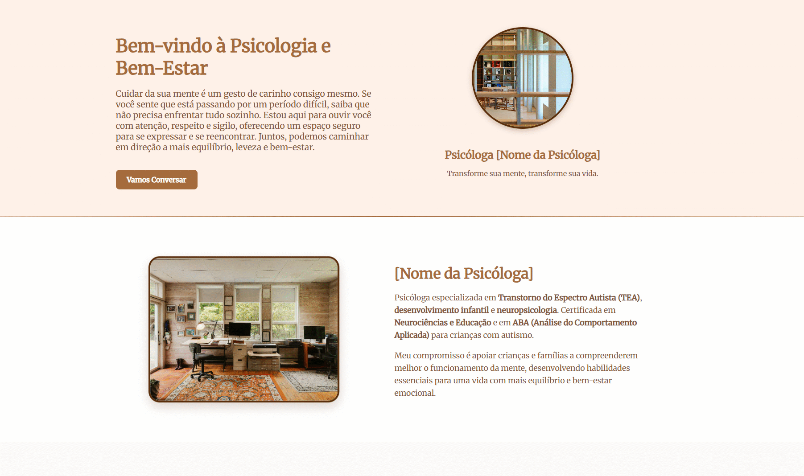

# 🧠 Landing Page - Psicologia e Bem-Estar

Landing page responsiva desenvolvida para uma profissional de psicologia, com foco em acolhimento, clareza e conversão de visitantes em contatos/agendamentos.



## 🔗 Acesse o projeto

- **Repositório:** [github.com/davidss93/landing-psicologia](https://github.com/davidss93/landing-psicologia)

## ✨ Sobre o projeto

O objetivo foi criar uma página institucional simples e humanizada, transmitindo confiança e acolhimento logo no primeiro contato visual. A paleta em tons terrosos e a tipografia selecionada reforçam uma identidade calma e profissional, adequada ao contexto da saúde mental.

## 🖥️ Funcionalidades

- Layout 100% responsivo (desktop, tablet e mobile)
- Seção de apresentação com call-to-action ("Vamos Conversar")
- Bloco "Sobre a Psicóloga" com foto e descrição de especialidades
- Página separada de Política de Privacidade
- Estrutura pronta para receber informações reais (nome, foto, contato, especialidades)

## 🛠️ Tecnologias utilizadas

- **HTML5** — estrutura semântica das páginas
- **CSS3** — estilização e responsividade
- **JavaScript** — interações da página

## 📁 Estrutura do projeto

```
landing-psicologia/
├── css/                          # Arquivos de estilo
├── img/                          # Imagens utilizadas no projeto
├── js/                           # Scripts JavaScript
├── index.html                    # Página principal
└── politica-de-privacidade.html  # Página de política de privacidade
```

## 🚀 Como executar localmente

Por ser um projeto estático (sem dependências ou build), basta:

1. Clonar o repositório
   ```bash
   git clone https://github.com/davidss93/landing-psicologia.git
   ```
2. Entrar na pasta do projeto
   ```bash
   cd landing-psicologia
   ```
3. Abrir o arquivo `index.html` diretamente no navegador (ou usar uma extensão como *Live Server* no VS Code para recarregamento automático)

## 👤 Autor

Desenvolvido por [**davidss93**](https://github.com/davidss93)

---

Projeto pessoal criado para fins de estudo e portfólio.